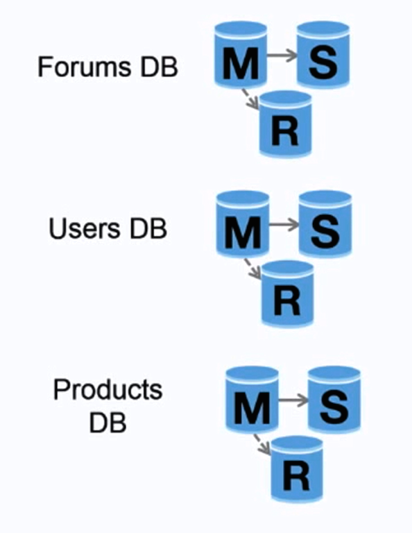

# System Design

<!-- @import "[TOC]" {cmd="toc" depthFrom=2 depthTo=4 orderedList=false} -->

<!-- code_chunk_output -->

- [Scalability](#scalability)
    - [Clones](#clones)
    - [Databases](#databases)
    - [Caches](#caches)
    - [Asynchronism](#asynchronism)
- [High-level trade-offs](#high-level-trade-offs)
    - [Performance vs scalability](#performance-vs-scalability)
    - [Latency vs throughput](#latency-vs-throughput)
    - [Availability vs consistency](#availability-vs-consistency)
- [Domain name system](#domain-name-system)
    - [Disadvantages: DNS](#disadvantages-dns)
- [Content delivery network](#content-delivery-network)
    - [Push CDNs](#push-cdns)
    - [Pull CDNs](#pull-cdns)
    - [Disadvantages: CDN](#disadvantages-cdn)
- [Load balancer](#load-balancer)
    - [Layer 4 load balancing](#layer-4-load-balancing)
    - [Layer 7 load balancing](#layer-7-load-balancing)
    - [Horizontal scaling](#horizontal-scaling)
    - [Disadvantages: load balancer](#disadvantages-load-balancer)
- [Reverse proxy (web server)](#reverse-proxy-web-server)
    - [Load balancer vs reverse proxy](#load-balancer-vs-reverse-proxy)
    - [Disadvantages: reverse proxy](#disadvantages-reverse-proxy)
    - [Summary from ChatGPT](#summary-from-chatgpt)
- [Application layer](#application-layer)
    - [Microservices](#microservices)
    - [Service Discovery](#service-discovery)
    - [Disadvantages: application layer](#disadvantages-application-layer)
- [Database](#database)
    - [Relational database management system (RDBMS)](#relational-database-management-system-rdbms)
    - [NoSQL](#nosql)
    - [SQL or NoSQL](#sql-or-nosql)
- [Cache](#cache)
    - [Client caching](#client-caching)
    - [CDN caching](#cdn-caching)
    - [Web server caching](#web-server-caching)
    - [Database caching](#database-caching)
    - [Application caching](#application-caching)
    - [Caching at the database query level](#caching-at-the-database-query-level)
    - [Caching at the object level](#caching-at-the-object-level)
    - [When to update the cache](#when-to-update-the-cache)
- [Asynchronism](#asynchronism-1)
    - [Message queues](#message-queues)
    - [Task queues](#task-queues)
    - [Back pressure](#back-pressure)
    - [Disadvantages: asynchronism](#disadvantages-asynchronism)

<!-- /code_chunk_output -->


## Scalability

#### Clones

Public servers of a scalable web service are hidden behind a load balancer. This load balancer evenly distributes load (requests from your users) onto your cluster of application servers. That means that if, for example, user Steve interacts with your service, he may be served at his first request by server 2, then with his second request by server 9 and then maybe again by server 2 on his third request.

Steve should always get the same results of his request back, independent what server he  “landed on”. That leads to the first golden rule for scalability: **every server contains exactly the same codebase and does not store any user-related data, like sessions or profile pictures, on local disc or memory**. 

**Sessions need to be stored in a centralized data store which is accessible to all your application servers**. It can be an external database or an external persistent cache, like Redis. **An external persistent cache will have better performance than an external database**. By external I mean that the data store does not reside on the application servers. Instead, it is somewhere in or near the data center of your application servers.


But what about deployment? **How can you make sure that a code change is sent to all your servers without one server still serving old code? This tricky problem is fortunately already solved by the great tool Capistrano**. It requires some learning, especially if you are not into Ruby on Rails, but it is definitely both the effort.


After “outsourcing” your sessions and serving the same codebase from all your servers, you can now create an image file from one of these servers (AWS calls this AMI - Amazon Machine Image.) Use this AMI as a “super-clone” that all your new instances are based upon. Whenever you start a new instance/clone, just do an initial deployment of your latest code and you are ready!


#### Databases

Now your servers can horizontally scale and you can already serve thousands of concurrent requests. But somewhere down the road your application gets slower and slower and finally breaks down. The reason: your database. It's something like MySQL, isn't it?

The required changes are more radical than just adding more cloned servers and may even require some boldness. In the end, you can choose from 2 paths:

**Path #1** is to stick with MySQL and keep the "beast" running. Hire a database administrator (DBA) tell him to do master-slave replication (read from slaves, write to master) and upgrade your master server by adding RAM, RAM and more RAM. In some months, your DBA will come up with words like "sharding", "denormalization" and "SQL tuning" and will look worried about the necessary overtime during the next weeks. At that point every new action to keep your database running will be more expensive and time consuming than the previous one. You might have been better off if you had chosen Path #2 while your database was still small and easy to migrate.

**Path #2** means to denormaliza right from the beginning and include no more Joins in any database query. You can stay with MySQL, and use it like a NoSQL database, or you can switch to a better and easier to scale NoSQL database like MongoDB or CouchDB. Joins will now need to be done in your application code. The sooner you do this step the less code you will have to change in the future. But even if you successfully switch to the latest and greatest NoSQL database and let your app do the dataset-joins, soon your database requests will again be slower and slower. You will need to introduce a cache.

#### Caches

Now you have a scalable database solution. You have no fear of storing terabytes anymore and the world is looking fine. But just for you. Your users still have to suffer slow page requests when a lot of data is fetched from the database. The solution is the implementation of a cache.

With "cache" I always mean in-memory caches like Redis or Memcached. **Please never do file-based caching**, it makes cloning and auto-scaling of your servers just a pain.

But back to in-memory caches. A cache is a simple key-value store and it should reside as a buffering layer between your application and your data storage. Whenever your application has to read data it should at first try to retrieve the data from your cache. Only if it's not in the cache should it then try to get the data from the main data source. Why should you do that? Because **a cache is lightning-fast**. It holds every dataset in RAM and requests are handled as fast as technically possible. For example, Redis can do several hundreds of thousands of read operations per second when being hosted on a standard server. Also writes, especially increments, are very, very fast. Try that with a database!

There are 2 patterns of caching your data. An old one and a new one:

**#1-Cached Database Queries**

That's still the most commonly used caching pattern. Whenever you do a query to your database, you store the result dataset in cache. A hashed version of your query is the cache key. The next time you run the query, you first check if it is already in the cache. The next time you run the query, you check at first the cache if there is already a result. This pattern has several issues. **The main issue is the expiration. It is hard to delete a cached result when you cache a complex query (who has not?). When one piece of data changes (for example a table cell), you need to delete all cached queries who may include that table cell**.

**#2-Cached Objects**

That's my strong recommendation and I always prefer this pattern. In general, see your data as an object like you already do in your code (classes, instances, etc.). Let your class assemble a dataset from your database and then store the complete instance of the class or the assembed dataset in the cache. Sounds theoretical, I know, but just look how you normally code. You have, for example, a class called "Product" which has a property called "data". It is an array containinng prices, texts, pictures, and customer reviews of your product. The property "data" is filled by several methods in the class doing several database requests which are hard to cache, since many things relate to each other. Now, do the following: when your class has finished the "assembling" of the data array, directly store the data array, or better yet the complete instance of the class, in the cache! This allows you to easily get rid of the object whenever something did change and makes the overall operation of your code faster and more logical.

And the best part: it makes asynchronous processing possible! Just imagine an army of worker servers who assemble your objects for you! The application just consumes the latest cached object and nearly never touches the databases anymore!


Some ideas of objects to cache:

+ user sessions (never use the database!)
+ fully rendered blog articles
+ activity streams
+ user <-> friend relationships


#### Asynchronism

Please imagine that you want to buy bread at your favorite bakery. So you go into the bakery, ask for a loaf of bread, but there is no bread there! Instead, you are asked to come back in 2 hours when your ordered bread is ready. That's annoying, isn't it?

To avoid such a "please wait a while" - situation, asynchronism needs to be done. And what's good for a bakery, is maybe also good for your web service or web app.

In general, there are two ways / paradigms asynchronism can be done.

**Async #1**
Let's stay in the former bakery picture. The first way of async processing is the "bake the breads at night and sell them in the morning" way. No waiting time at the cash register and a happy customer. Referring to a web app this means doing the time-consuming work in advance and serving the finished work with a low request time.

Very often this paradigm is used to turn dynamic content into static content. Pages of a website, maybe built with a massive framework or CMS, are prerendered and locally stored as static HTML files on every change. Often these computing tasks are done on a regular basis, maybe by a script which is called every hour by a cronjob. This pre-computing of overall general data can extremely improve websites and web apps and makes them very scalable and performant. Just imagine the scalability of your website if the script would upload these pre-rendered HTML pages to AWS S3 or Cloudfront or another Content Delivery Network! Your website would be super responsive and could handle millions of visitors per hour!

**Async #2**
Back to the bakery. Unfortunately, sometimes customers has special requests like a birthday cake with "Happy Birthday, Steve!" on it. The bakery can not foresee these kind of customer wishes, so it must start the task when the customer is in the bakery and tell him to come back at the next day. Refering to a web service that means to handle tasks asynchronously.

Here is a typical workflow:

A user comes to your website and starts a very computing intensive task which would take several minutes to finish. So the frontend of your website sends a job onto a job queue and immediately signals back to the user: your job is in work, please continue to the browse the page. The job queue is constantly checked by a bunch of workers for new jobs. If there is a new job then the worker does the job and after some minutes sends a signal that the job was done. The frontend, which constantly checks for new "job is done" - signals, sees that the job was done and informs the user about it. I know, that was a very simplified example.

If you now want to dive more into the details and actual technical design, I recommend you take a look at the first 3 tutorails on the [RabbitMQ website](https://web.archive.org/web/20230221220524/http://www.rabbitmq.com/). RabbitMQ is one of many systems which help to implement async processing. You could also use ActiveMQ or a simple [Redis list](https://web.archive.org/web/20230406150152/https://redis.io/docs/data-types/). The basic idea is to have a queue of tasks or jobs that a worker can process. Asynchronism seems complicated, but it is definitely worth your time to learn about it and implement it yourself. Backends become nearly infinitely scalable and frontends become snappy which is good for the overall user experience.

If you do something time-consuming, try to do it always asynchronously.


## High-level trade-offs

Keep in mind that **everything is a trade-off.**

#### Performance vs scalability

A service is scalable if it results in increased performance in a manner proportional to resources added. Generally, increasing performance means serving more units of work, but it can also be to handle larger units of work, such as when datasets grow.

Another way to look at performance vs scalability:

+ If you have a performance problem, your system is slow for a single user.
+ If you have a scalability problem, your system is fast for a single user but slow under heavy load.


Scalability is frequently used as a magic incantation to indicate that something is badly designed or broken. Often you hear in a discussion "but that doesn't scale" as the magical word to end an argument. This is often an indication that developers are running into situations where the architecture of their system limits their ability to grow their service. If scalability is used in a positive sense it is in general to indicate a desired property as in "our platform needs good scalability".

What is it that we really mean by scalability? *A service is said to be scalable if when we increase the resources in a system, it results in increased performance in a manner proportional to resources added*. Increasing performance in general means serving more units of work, but it can also be to handle larger units of work, such as when datasets grow.

In distributed systems there are other reasons for adding resources to a system; for example to improve the reliability of the offered service. Introducing redundancy is an important first line of defense against failures. *An always-on service is said to be scalable if adding resources to facilitate redundancy does not result in a loss of performance*.


Why is scalability so hard? Because scalability cannot be an after-thought. It requires applications and platforms to be designed with scaling in mind, such that adding resources actually results in improving the performance or that if redundancy is introduced the system performance is not adversely affected. Many algorithms that perform reasonably well under low load and small datasets can explode in cost if either requests rates increase, the dataset grows or the number of nodes in the distributed system increases.

A second problem area is that growing a system throught scale-out generally results in a system that has to come to terms with heterogeneity. Resources in the system increase in diversity as next generations of hardware come on line, as bigger or more powerful resources become more cost-effective or when some resources are placed further apart. Heterogeneity means that some nodes will be able to process faster or store more data than other nodes in a system and algorithms that rely on uniformity either break down under these conditions or underutilize the newer resources.

Is achieving good scalability possible? Absolutely, but only if we architect and engineer our systems to take scalability into account. For the systems we build we must carefully inspect along which axis we expect the system to grow, where redundancy is required, and how one should handle heterogeneity in this system, and make sure that architects are aware of which tools they can use for under which conditions, and what the common pitfalls are.

ref: [A word on Scalability](https://www.allthingsdistributed.com/2006/03/a_word_on_scalability.html)

ref: [Scalability, availability, stability, patterns](https://www.slideshare.net/slideshow/scalability-availability-stability-patterns/4062682)


#### Latency vs throughput

**Latency** is the time to perform some action or to product some result.

**Throughput** is the number of such actions or results per unit of time.

Generally, you should aim for **maximal throughput** with **acceptable latency**.


One of the effects of adopting a [High Level Synthesis design methodology](https://www.cadence.com/en_US/home/resources/white-papers/how-the-productivity-advantages-of-high-level-synthesis-can-improve-ip-design-verification-and-reuse-wp.html) is that the barrier between "Systems designers" and "Hardware designers" is substantially reduced if not totally eliminated. Suddenly, both "Systems designers" and "Hardware designers" are using not only the same input language to specify their models (C++) but they are also exposed to the same terminology. For this reason, "Hardware designers" are suddenly exposed to two terms to wchi they have had little or no exposure in the past.

The purpose of this post is to clarify two "systems" terms that are usually confused and sometimes used interchangeably: latency and throughput.

**Definition of terms**

Let us attempt to define those two terms:

**Latency** is the time required to perform some action or to produce some result. Latency is measured in units of time -- hours, minutes, seconds, nanoseconds or clock periods.

**Throughput** is the number of such actions executed or results produced per unit of time. This is measured in units of whatever is being produced (cars, motorcycles, I/O samples, memory words, iterations) per unit of time. The term "memory bandwidth" is sometimes used to specify the throughput of memory systems.

**A simple example**

The following manufacturing example should clarify these two concepts:

An assembly line is manufacturing cars. It takes eight hours to manufacture a car and that the factory produces one hundred and twenty cars per day.

The latency is: 8 hours.

The throughput is: 120 cars/day or 5 cars/hour.


#### Availability vs consistency

**CAP theorem**

In a distributed computer system, you can only support two of the following guarantees:

*Consistency* - Every read receives the most recent write or an error

*Availability* - Every request receives a response, without guarantee that it contains the most recent version of the information

*Parttion Tolerance* - The system continues to operate despite arbitrary partitioning due to network failures.

Networks aren't reliable, so you'll need to support partition tolerance. You'll need to make a software tradeoff between consistency and availability.

**CP** - consistency and partition tolerance

Waiting for a response from the partitioned node might result in a timeout error. CP is a good choice if your business needs require atomic reads and writes.

**AP** - availability and partition tolerance

Response return the most readily available version of the data available on any node, which might not be the latest. Writes might take some time to propagate when the partition is resolved.

AP is a good choice if the business needs to allow for eventual consistency or when the system needs to continue working despite external errors.

ref: [CAP theorem revisited](https://robertgreiner.com/cap-theorem-revisited/)

ref: [A plain english introduction to CAP theorem](http://ksat.me/a-plain-english-introduction-to-cap-theorem)

ref: [CAP FAQ](https://github.com/henryr/cap-faq)

ref: [The CAP theorem](https://www.youtube.com/watch?v=k-Yaq8AHlFA)


##### Consistency patterns

With multiple copies of the same data, we are faced with options on how to synchronize them so clients have a consistent view of the data. Recall the definition of consistency from the CAP theorem - Every read receives the most recent write or an error.

**Weak consistency**

After a while, reads may or may not see it. A best effort approach is taken.

This approach is seen in systems such as memcached. Weak consistency works well in real time use cases such as VoIP, video chat, and realtime multiplayer games. For example, if you are on a phone call and lose reception for a few seconds, when you regain connection you do not hear what was spoken during connection loss.


**Eventual consistency**

After a write, reads will eventually see it (typically within milliseconds). Data s replicated asynchronously.

This approach is seen in systems such as DNS and email. Eventual consistency works well in highly available systems.


**Strong consistency**

After a while, reads will see it. Data is replicated synchronously.

This approach is seen in file systems and RDBMSes. Strong consistency works well in systems that need transactions.

Ref: [Transactions across data centers](https://snarfed.org/transactions_across_datacenters_io.html)


##### Availability patterns

There are two complementary patterns to support high availability: fail-over and replication

**Fail-over**

+ Active-passive: With active-passive fail-over, heartbeats are sent between the active and the passive server on standby. If the heartbeat is interrupted, the passive server takes over the active's IP address and resumes service.

  The length of downtime is determined by whether the passive server is already running in 'hot' standby or whether it needs to start up from 'cold' standby. Only the active server handles traffic.

  Active-passive failover can also be referred to as master-slave failover.


+ Active-active: In active-active, both servers are managing traffic, spreading the load between them.

  If the servers are public-facing, the DNS would need to know about the public IPs of both servers. If the servers are internal-facing, application logic would need to know about both servers.

  Active-active failover can also be referred to as master-master failover.

**Disadvantages: failover**

+ Fail-over adds more hardware and additional complexity.
+ There is a potential for loss of data if the active system fails before any newly written data can be replicated to the passive.
  
##### Replication

**Master-slave and master-master**

This topic is further discussed in the Database section

**Availability in numbers**

Availability is often quantified by uptime (or downtime) as a percentage of time the service is available. Availability is generally measured in number of 9s--a service with 99.99% availability is described as having four 9s.

**99.9 availability - thres 9s**

| Duration | Acceptable downtime | 
| -- | -- |
| Downtime per year | 8h 45min 57s| 
| Downtime per month | 43m 49.7s |
| Downtime per week | 10m 4.8s |
| Downtime per day | 1m 26.4s |

**99.99% availability - four 9s**

| Duration | Acceptable downtime | 
| -- | -- |
| Downtime per year | 52min 35.7s | 
| Downtime per month | 4m 23s | 
| Downtime per week | 1m 5s |
| Downtime per day | 8.6s |

**Availability in parallel vs in sequence**

If a service consists of multiple components prone to failure, the service's overall availability depends on whether the components are in sequence or in parallel.

+ In sequence: Overall availability decreases when two components with availability < 100% are in sequence:
  ```
  Availability (Total) = Availability (Foo) * Availability (Bar)
  ```

  If both `Foo` and `Bar` each had 99.9% availability, their total availability in sequence would be 99.8%.

+ In parallel: Overall availability increases when two components with availability < 100% are in parallel:
  ```
  Availability (Total) = 1 - (1 - Availability (Foo)) * (1 - Availability (Bar))
  ```

  If both `Foo` and `Bar` each had 99.9% availability, their total availability in parallel would be 99.9999%.


## Domain name system

How does DNS work?


A Domain Name System (DNS) translates a domain name such as www.example.com to an IP address.

DNS is hierarchical, with a few authoritative servers at the top level. Your router or ISP provides information about which DNS server(s) to contact when doing a lookup. Lower level DNS servers cache mappings, which could become stale due to DNS propagation delays. DNS results can also be cached by your browser or OS for a certain period of time, determined by [time to live](https://en.wikipedia.org/wiki/Time_to_live)

+ NS record (name server) - Specifies the DNS servers for your domain/subdomain.

+ MX record (mail exchange) - Specifies the mail servers for accepting messages.

+ A record (address) - Points a name to an IP address.

+ CNAME (canonical) - Points a name to another name or `CNAME` or to an `A` record


Services such as [CloudFlare](https://www.cloudflare.com/dns/) and [Route 53](https://aws.amazon.com/route53/) provide managed DNS services. Some DNS services can route traffic through various methods:

+ [Weighted round robin](https://www.jscape.com/blog/load-balancing-algorithms)
  - Prevent traffic from going to servers under maintenance
  - Balance between varying cluster sizes
  - A/B testing

+ [Latency-based](https://docs.aws.amazon.com/Route53/latest/DeveloperGuide/routing-policy-latency.html)
  
+ [Geolocation-based](https://docs.aws.amazon.com/Route53/latest/DeveloperGuide/routing-policy-geo.html)


#### Disadvantages: DNS

+ Accessing a DNS server introduces a slight delay, although mitigated by caching described above.
+ DNS server management could be complex and is generally managed by [governments, ISPs, and large companies.](http://superuser.com/questions/472695/who-controls-the-dns-servers/472729)
+ DNS servicess have recently come under [DDoS attack](http://dyn.com/blog/dyn-analysis-summary-of-friday-october-21-attack/), preventing users from accessing websites such as Twitter without knowing Twitter's IP address.


## Content delivery network

A content delivery network (CDN) is a globally distributed network of proxy servers, serving content from locations closer to the user. Generally, static files such HTML/CSS/JS, photos, and videos are served from CDN, although some CDNs such as Amazon's CloudFront support dynamic content. The site's DNS resolution will tell clients which server to contact.

Serving content from CDNs can significantly improve performance in two ways:

+ Uers receive content from data centers close to them
+ Your servers do not have to serve requests that the CDN fulfills


#### Push CDNs

Push CDNs receive new content whenever changes occur on your server. You take full responsibility for providing content, uploading directly to the CDN and rewriting URLs to point to the CDN. You can configure when content expires and when it is updated. Content is uploaded only when it is new or changed, minimizing traffic, but maximizing storage.

Sites with a small amount of traffic or sites with content that isn't often updated work well with push CDNs. Content is placed on the CDNs once, instead of being re-pulled at regular intervals.

#### Pull CDNs

Pull CDNs grab new content from your server when the first user requests the content. You leave the content on your server and rewrite URLs to point to the CDN. This results in a slower request until the content is cached on the CDN.

A time-to-live(TTL) determines how long content is cached. Pull CDNs minimize storage space on the CDN, but can create redundant traffic if files expire and are pulled before they are actually changed.

Sites with heavy traffic work well with pull CDNs, as traffic is spread out more evenly with only recently-requested content remaining on the CDN.


#### Disadvantages: CDN

+ CDN costs could be significant depending on traffic, although this should be weighed with additional costs you could incur not using a CDN.
+ Content might be stale if it is updated before the TTL expires it.
+ CDNs require changing URLs for static content to point to the CDN.

> ref: [Globally distributed content delivery](https://figshare.com/articles/Globally_distributed_content_delivery/6605972)
> 
> ref: [The differences between push and pull CDNs](http://www.travelblogadvice.com/technical/the-differences-between-push-and-pull-cdns/)
> 
> ref: [Wikipedia](https://en.wikipedia.org/wiki/Content_delivery_network)


## Load balancer


Load balancers distribute incoming client requests to computing resources such as application servers and databases. In each case, the load balancer returns the response fro the computing resource to the appropriate client. Load balancers are effective at:

+ Preventing requests from going to unhealthy servers
+ Preventing overloading resources
+ Helping to eliminate a single point of failure

Load balancers can be implemented with hardware (expensive) or with software such HAProxy.

Additional benefits include:

+ **SSL termination** - Decrypt incoming requests and encrypt server responses so backend servers do not have to perform these potentially expensive operations
  - Removes the need to install [X.509 certificates](https://en.wikipedia.org/wiki/X.509) on each server

+ **Session persistence** - Issue cookies and route a specific client's requests to same instance if the web apps do not keep track of sessions

To protect againsst failures, it's common to set up multiple load balancers, either in active-passive or active-active mode.

Load balancers can route traffic based on various metrics, including:

+ Random
+ Least loaded
+ Session/cookies
+ Round robin or weighted round robin
+ Layer 4
+ Layer 7


#### Layer 4 load balancing

Layer 4 load balancers look at info at the transport layer to decide how to distribute requests. Generally, this involves the source, destination IP addresses, and ports in the header, but not the contents of the packet. Layer 4 load balancers forward network packets to and from the upstream server, performing [Network Address Translation(NAT)](https://www.haproxy.com/glossary/what-is-layer-4-load-balancing)


#### Layer 7 load balancing

Layer 7 load balancers look at the application layer to decide how to distribute requests. This can involve contents of the header, message, and cookies. Layer 7 load balancers terminate network traffic, reads the message, makes a load-balancing decision, then opens a connection to the selected server. For example, a layer 7 load balancer can direct video traffic to servers that host videos while directing more sensitive user billing traffic to security-hardened servers.

At the cost of flexibility, layer 4 load balancing requires less time and computing resources than layer 7, although the performance impact can be minimal on modern commodity hardware.


#### Horizontal scaling

Load balancers can also help with horizontal scaling, improving performance and availability. Scaling out using commodity machines is more cost efficient and results in higher availability than scaling up a single server on more expensive hardware, called Vertical Scaling. It is also easier to hire for talent working on commodity hardware than it is for specialized enterprise systems.

**Disadvantages: horizontal scaling**

+ Scaling horizontally introduces complexity and involves cloning servers
  - Servers should be stateless: they should not contain any user-related data like sessions or profile pictures
  - Sessions can be stored in a centralized data store such as a database or a persistent cache
+ Downstream servers such as caches and databases need to handle more simultaneous connections as upstream servers scale out


#### Disadvantages: load balancer

+ The load balancer can become a performance bottleneck if it does not have enough resources or if it is not configured properly.
+ Introducing a load balancer to help eliminate a single point of failure results in increased complexity.
+ A single load balancer is a single point of failure, configuring multiple load balancers further increases complexity.
  
> ref: [NGINX architecture](https://blog.nginx.org/blog/inside-nginx-how-we-designed-for-performance-scale)
> 
> ref: [HAProxy architecture guide](https://www.haproxy.org/download/1.2/doc/architecture.txt)
> 
> ref: [Wikipedia](https://en.wikipedia.org/wiki/Load_balancing_(computing))
> 
> ref: [Layer 4 load balancing](https://www.haproxy.com/blog/layer-4-vs-layer-7-load-balancing)
> 
> ref: [ELB listener config](https://docs.aws.amazon.com/elasticloadbalancing/latest/classic/elb-listener-config.html)


## Reverse proxy (web server)


A reverse proxy is a web server that centralizes internal services and provides unified interfaces to the public. Request from clients are forwarded to a server that can fulfill it before the reverse proxy returns the server's response to the client.

Additional benefits include:

+ **Increased security** - Hide information about backend servers, blacklist IPs, limit number of connections per client
+ **Increased scalability and flexibility** - Clients only see the reverse proxy's IP, allowing you to scale servers or change their configuration
+ **SSL termination** - Decrypt incoming requests and encrypt server responses so backend servers do not have to perform these potentially expensive operations
  - Removes the need to install X.509 certificates on each server
+ **Compression** - Compress server responses
+ **Caching** - Return the response for cached requests
+ **Static content** - Serve static content directly
  - HTML/CSS/JS
  - Photos
  - Videos
  - Etc

#### Load balancer vs reverse proxy

+ Deploying a load balancer is useful when you have multiple servers. Often, load balancers route traffic to a set of servers serving the same function.
+ Reverse proxies can be useful even with just one web server or application server, opening up the benefits described in the previous section.
+ Solutions such as NGINX and HAProxy can support both layer 7 reverse proxying and load balancing.

#### Disadvantages: reverse proxy

+ introducing a reverse proxy results in increased complexity.
+ A single reverse proxy is a single point of failure, configuring multiple reverse proxies further increases complexity.

> ref: [Wikipedia](https://en.wikipedia.org/wiki/Reverse_proxy)

> ref: [Reverse proxy vs load balancer](https://www.strongdm.com/what-is/reverse-proxy-vs-load-balancer#:~:text=Reverse%20Proxy%20and%20Load%20Balancer%20Key%20Takeaways%3A&text=Both%20reverse%20proxies%20and%20load,traffic%20and%20ensuring%20high%20availability.)


#### Summary from ChatGPT

**Reverse Proxy**: A reverse proxy is a server that sits between client devices (like a browser) and a web server, intercepting requests from clients and forwarding them to the appropriate backend server. The reverse proxy retrieves the response from the backend server and sends it back to the client. This setup provides several benefits, including:

+ Load Distribution: It can distribute client requests to multiple backend servers, balancing the load.
+ Security: It can hide the identity and structure of the backend servers, adding a layer of security by preventing direct access to the servers.
+ Caching: It can cache content to reduce the load on backend servers and speed up response times.
+ SSL Termination: It can manage SSL certificates and handle SSL encryption/decryption, offloading this work from backend servers.
Compression: It can compress responses to reduce bandwidth usage.
**Load Balancer**: A load balancer is a specific type of reverse proxy that distributes network or application traffic across multiple servers. The primary goal is to ensure that no single server becomes overwhelmed with too much traffic, which can lead to poor performance or even downtime. Load balancers operate in two main types:

+ Layer 4 Load Balancing: Works at the transport layer (TCP/UDP) and forwards requests based on IP address and port number.
+ Layer 7 Load Balancing: Works at the application layer (HTTP/HTTPS), making more intelligent decisions based on content, such as URLs or HTTP headers.

**Key Differences**
+ Functionality:
  - Reverse Proxy: Acts as an intermediary between clients and servers, offering additional features like caching, SSL termination, and security enhancements.
  - Load Balancer: Focuses primarily on distributing traffic across multiple servers to ensure high availability and reliability.
+ Use Cases:
  - Reverse Proxy: Used when you want to hide backend servers, cache content, or handle SSL certificates centrally.
  - Load Balancer: Used to distribute traffic to prevent any single server from becoming a bottleneck, ensuring that the service remains available and responsive.

In many cases, a reverse proxy can include load balancing as one of its features, making the distinction sometimes blurry. However, the primary role of a load balancer is traffic distribution, while a reverse proxy may offer a broader range of features.


## Application layer


Separating out the web layer from the application layer (also known as platform layer) allows you scale and configure both layers independently. Adding a new API results in adding application servers without necessarily adding web servers. The single responsibility principle advocates for small and autonomous services that work together. Small teams with small services can plan more aggressively for rapid growth.

Workers in the application layer also help enable asynchronism.


#### Microservices

Related to this discussion are [microservices](https://en.wikipedia.org/wiki/Microservices), which can be described as a suite of independently deployable, small, modular services. Each service runs a unique process and communicates through a well-defined, lightweight mechanism to serve a business goal.

Pinterest, for example, could have the following microservices: user profile, follower, feed, search, photo upload, etc.


#### Service Discovery

Systems such as [Consul](https://developer.hashicorp.com/consul/docs), [Etcd](https://etcd.io/), and [Zookeeper](https://www.slideshare.net/slideshow/introduction-to-apache-zookeeper/16567274) can help services find each other by keeping track of registered names, addresses, and ports. Health checks help verify service integrity and are often done using an HTTP endpoint. Both Consul and Etcd have a built in ke-value store that can be useful for storing config values and other shared data.


#### Disadvantages: application layer

+ Adding an application layer with loosely coupled services requires a different approach from an architectural, operations, and process viewpoint (vs a monolithic system)
+ Microservices can add complexity in terms of deployments and operations.

> ref: [Intro to architecting systems for scale](https://lethain.com/introduction-to-architecting-systems-for-scale/)

> ref: [Crack the system design interview](https://tianpan.co/notes/2016-02-13-crack-the-system-design-interview)

> ref: [Service oriented architecture](https://en.wikipedia.org/wiki/Service-oriented_architecture)

> ref: [Here's what you need to know about building microservices](https://cloudncode.blog/2016/07/22/msa-getting-started/)


## Database


#### Relational database management system (RDBMS)

A relational database like SQL is a collection of data items organized in tables.

**ACID** is a set of properties of relational database [transactions](https://en.wikipedia.org/wiki/Database_transaction).

+ **Atomicity** - Each transaction is all or nothing
+ **Consistency** - Any transaction will bring the database from one valid state to another
+ **Isolation** - Executing transactions concurrently has the same results as if the transactions were executed serially
+ **Durability** - Once a transaction has been committed, it will remain so

There are many techniques to scale a relational database: **master-slave replication, master-master replication, federation, sharding, denormalization**, and **SQL tuning**.

###### Master-slave replication

The master serves reads and writes, replicating writes to one or more slaves, which serve only reads.Slaves can also replicate to additional slaves in a tree-like fashion. If the master goes offline, the system can continue to operate in read-only mode until a slave is promoted to a master or a new master is provisioned.


**Disadvantages: master-slave replication**

+ Additional logic is needed to promote a slave to a master
+ See `Disadvantages: replication` for points related to both master-slave and master-master.

###### Master-master replication

Both masters serve reads and writes and coordinate with each other on writes. If either master goes down, the system can continue to operate with both reads and writes.


**Disadvantages: master-master replication**

+ You'll need a load balancer or you'll need to make changes to your application logic to determine where to write.
+ Most master-master systems are either loosely consistent (violating ACID) or have increased write latency due to synchronization.
+ Conflict resolution comes more into play as more write nodes are added and as latency increases.
+ See `Disadvantages: replication` for points related to both master-slave and master-master.

**Disadvantages: replication**

+ There is a potential for loss of data if the master fails before any newly written data can be replicated to other nodes.
+ Writes are replayed to the read replicas. If there are a lot of writes, the read replicas can get bogged down with replaying writes and can't do as many reads.
+ The more read slaves, the more you have to replicate, which leads to greater replication lag.
+ On some systems, writing to the master can spawn multiple threads to write in parallel, whereas read replicas only support writing sequentially with a single thread.
+ Replication adds more hardware and additional complexity.

> ref: [Scalability, availability, stability, patterns](https://www.slideshare.net/slideshow/scalability-availability-stability-patterns/4062682)

> ref: [Multi-master replication](https://en.wikipedia.org/wiki/Multi-master_replication)


###### Federation



Federation (or functional partitioning) splits up databases by function. For example, instead of a single, monolithic database, you could have three databases: **forums**, **users**, **products**, resulting in less read and write traffic to each database and therefore less replication lag. Smaller databases result in more data that can fit in memory, which in turn results in more cache hits due to improved cache locality. With no single central master serializing writes you can write in parallel, increasing throughput.

**Disadvantages: federation**

+ Federation is not effective if your schema requires huge functions or tables.
+ You'll need to update your application logic to determine which database to read and write.
+ Joining data from two databases is more complex with a [server link](https://stackoverflow.com/questions/5145637/querying-data-by-joining-two-tables-in-two-database-on-different-servers).
+ Federation adds more hardware and additional complexity.

> ref: [Scaling up to your first 10 million users](https://www.youtube.com/watch?v=kKjm4ehYiMs)


###### Sharding


Sharding distributes data across different databases such that each database can only manage a subset of the data. Taking a users database as an example, as the number of users increases, more shards are added to the cluster.

Similar to the advantages of federation, sharding results in less read and write traffic, less replication, and more cache hits. Index size is also reduced, which generally improves performance with faster queries. If one shard goes down, the other shards are still operational, although you'll want to add some form of replication to avoid data loss. Like federation, there is no single central master serializing writes, allowing you to write in parallel with increased throughput.

Common ways to shard a table of users is either through the user's last name initial or the user's geographic location.

**Disadvantages: sharding**

+ You'll need to update your application logic to work with shards, which could result in complex SQL queries.
+ Data distribution can become lopsided in a shard. For example, a set of power users on a shard could result in increased load to that shard compared to others.
  - Rebalancing adds additional complexity. A sharding function based on [consistent hashing](https://www.paperplanes.de/2011/12/9/the-magic-of-consistent-hashing.html) can reduce the amount of transferred data.
+ Joining data from multiple shards is more complex.
+ Sharding adds more hardware and additional complexity.

> ref: [The coming of the shard](highscalability.com/blog/2009/8/6/an-unorthodox-approach-to-database-design-the-coming-of-the.html)

> ref: [Shard database architecture](https://en.wikipedia.org/wiki/Shard_(database_architecture))

> ref: [Consistent hashing](www.paperplanes.de/2011/12/9/the-magic-of-consistent-hashing.html)


###### Denormalization

Denormalization attempts to improve read performance at the expense of some write performance. Redundant copies of the data are written in multiple tables to avoid expensive joins. Some RDBMS such as `PostgreSQL` and `Oracle` support [materialized views](https://en.wikipedia.org/wiki/Materialized_view) which handle the work of storing redundant information and keeping redundant copies consistent.

Once data becomes distributed with techniques such as `federation` and `sharding`, managing joins across data centers further increases complexity. Denormalization might circumvent the need for such complex joins.

In most systems, reads can heavily outnumber writes 100:1 or even 1000:1. A read resulting in a complex database join can be very expensive, spending a significant amount of time on disk operations.

**Disadvantages: denormalization**

+ Data is duplicated.
+ Constraints can help redundant copies of information stay in sync, which increases complexity of the database design.
+ A denormalized database under heavy write load might perform worse than its normalized counterpart.

> ref: [Denormalization](https://en.wikipedia.org/wiki/Denormalization)


###### SQL tuning

SQL tuning is a broad topic and many books have been written as reference.

It's important to benchmark and profile to simulate and uncover bottlenecks.

+ **Benchmark** - Simulate high-load situations with tools such as [ab](https://httpd.apache.org/docs/2.2/programs/ab.html)
+ **Profile** - Enable tools such as the [slow query log](dev.mysql.com/doc/refman/5.7/en/slow-query-log.html) to help track performance issues. 

Benchmarking and profiling might point you to the following optimizations.

**Tighten up the schema**

+ MySQL dumps to disk in contiguous blocks for fast access.
+ Use `CHAR` instead of `VARCHAR` for fixed-length fields.
  - `CHAR` effectively allows for fast, random access, whereas with `VARCHAR`, you must find the end of a string before moving onto the next one.
+ Use `TEXT` for large blocks of text such as blog posts. `TEXT` also allows for boolean searches. Using a `TEXT` field results in storing a pointer on disk that is used to locate the text block.
+ Use `INT` for larger numbers up to 2^32 or 4 billion.
+ Use `DECIMAL` for currency to avoid floating point representations errors.
+ Aviod storing large `BLOBS`, store the location of where to get the object instead.
+ `VARCHAR(255)` is the largest number of characters that can be counted in an 8 bit number, often maximizing the use of a byte in some RDBMS.
+ Set the `NOT NULL` constraint where applicable to [improve search performance](https://stackoverflow.com/questions/1017239/how-do-null-values-affect-performance-in-a-database-search)

**Use good indices**

+ Columns that you are querying (`SELECT`, `GROUP BY`, `ORDER BY`, `JOIN`) could be faster with indices.
+ Indices are usually represented as self-balancing [B-tree](https://en.wikipedia.org/wiki/B-tree) that keeps data sorted and allows searches, sequential access, insertions, and deletions in logarithmic time.
+ Placing an index can keep the data in memory, requiring more space.
+ Writes could also be slower since the index also needs to be updated.
+ When loading large amounts of data, it might be faster to disable indices, load the data, then rebuild the indices.

**Avoid expensive joins**

+ Denormalize where performance demands it.

**Partition tables**

+ Break up a table by putting hot spots in a separate table to help keep it in memory.

**Tune the query cache**

+ In some cases, the [query cache](https://dev.mysql.com/doc/refman/5.7/en/query-cache.html) could lead to [performance issues](https://www.percona.com/blog/2016/10/12/mysql-5-7-performance-tuning-immediately-after-installation/)


> ref: [Tips for optimizing MYSQL queries](aiddroid.com/10-tips-optimizing-mysql-queries-dont-suck/)

> ref: [Is there a good reason i see VARCHAR(255) used so often?](https://stackoverflow.com/questions/1217466/is-there-a-good-reason-i-see-varchar255-used-so-often-as-opposed-to-another-l)

> ref: [How do null values affect performance](https://stackoverflow.com/questions/1017239/how-do-null-values-affect-performance-in-a-database-search)

> ref: [slow query log](dev.mysql.com/doc/refman/5.7/en/slow-query-log.html)


#### NoSQL

NoSQL is a collection of data items represented in a **key-value store**, **document store**, **wide column store**, or a **graph database**. Data is denormalized, and joins are generally done in the application code. Most NoSQL stores lack true ACID transactions and favor eventual consistency.

BASE is often used to describe the properties of NoSQL databases. In comparison with the CAP Theorem, BASE chooses availability over consistency.

+ Basically available - the system guarantees availability.
+ Soft state - the state of the system may change over time, even without input.
+ Eventual consistency - the system will become consistent over a period of time, given that the system doesn't receive input during that period.

In addition to choosing between SQL or NoSQL, it is helpful to understand which type of NoSQL database best fits your use case. We'll review **key-value stores**, **document stores**, **wide column stores**, and **graph databases** in the next section.

###### Key-value store

```
Abstraction: hash table
```

A key-value store generally allows for O(1) reads and writes and is often backed by memory or SSD. Data stores can maintain keys in [lexicographic order](https://en.wikipedia.org/wiki/Lexicographic_order), allowing efficient retrieval of key ranges. Key-value stores can allow for storing of metadata with a value.

Key-value stores provide high performance and are often used for simple data models or for rapidly-changing data, such as an in-memory cache layer. Since they offer only a limited set of operations, complexity is shifted to the application layer if additional operations are needed.

A key-value store is the basis for more complex systems such as a document store, and in some cases, a graph database.

> ref: [Key-value database](https://en.wikipedia.org/wiki/Key%E2%80%93value_database)

> ref: [Disadvantages of key-value stores](https://stackoverflow.com/questions/4056093/what-are-the-disadvantages-of-using-a-key-value-table-over-nullable-columns-or)

> ref: [Redis architecture](http://qnimate.com/overview-of-redis-architecture/)

> ref: [Memcached architecture](https://adayinthelifeof.nl/2011/02/06/memcache-internals/)


###### Document store

```
Abstraction: key-value store with documents stored as values
```

A document store is centered around documents (XML, JSON, binary, etc), where a document stores all information for a given object. Document stores provide APIs or a query language to query based on the internal structure of the document itself. *Note, many key-value stores include features for working with a value's metadata, blurring the lines between these two storage types.*

Based on the underlying implementation, documents are organized by collections, tags, metadata, or directories. Although documents can be organized or grouped together, documents may have fields that are completely different from each other.

Some document stores like MongoDB and CouchDB also provide a SQL-like language to perform complex queries. DynamoDB supports both key-values and documents.

Document stores provide high flexibility and are often used for working with occasionally changing data.

> ref: [Document-oriented database](https://en.wikipedia.org/wiki/Document-oriented_database)

> ref: [MongoDB architecture](https://www.mongodb.com/resources/products/fundamentals/mongodb-architecture)

> ref: [Elasticsearch architecture](https://www.elastic.co/blog/found-elasticsearch-from-the-bottom-up)


###### Wide column store


```
Abstraction: nested map ColumnFamily<RowKey, Columns<ColKey, Value, Timestamp>>
```

A wide column store's basic unit of data is a column (name/value pair). A column can be grouped in column families (analogous to a SQL table). Super column families further group column families. You can access each column independently with a row key, and columns with the same row key form a row. Each value contains a timestamp for versioning and for conflict resolution.

Google introduced [Bigtable](https://www.read.seas.harvard.edu/~kohler/class/cs239-w08/chang06bigtable.pdf) as the first wide column store, which influenced the open-source [HBase](https://www.edureka.co/blog/hbase-architecture/) often-used in the Hadoop ecosystem, and [Cassandra](https://docs.datastax.com/en/archived/cassandra/3.0/cassandra/architecture/archIntro.html) from Fackbook. Stores such as BigTable, HBase, and Cassandra maintain keys in lexicographic order, allowing efficient retrieval of selective key ranges.

Wide column stores offer high availability and high scalability. They are often used for very large data sets.

> ref: [SK & NoSQL, a brief history](https://blog.grio.com/2015/11/sql-nosql-a-brief-history.html)


###### Graph database


```
Abstraction: graph
```

In a graph database, each node is a record and each arc is a relationship between two nodes. Graph databases are optimized to represent complex relationships with many foreign keys or many-to-many relationships.

Graph databases offer high performance for data models with complex relationships, such as a social network. They are relatively new and are not yet widely-used; it might be more difficult to find development tools and resources. Many graphs can only be accessed with REST APIs.

> ref: [Graph database](https://en.wikipedia.org/wiki/Graph_database)

> ref: [Neo4j](https://neo4j.com/)

###### further reading

> ref: [Explanation of base terminology](https://stackoverflow.com/questions/3342497/explanation-of-base-terminology)

> ref: [NoSQL databases a survey and decision guidance](https://medium.baqend.com/nosql-databases-a-survey-and-decision-guidance-ea7823a822d?gi=31e4d15f392f#.wskogqenq)

> ref: [Introduction to NoSQL](https://www.youtube.com/watch?v=qI_g07C_Q5I)

> ref: [NoSQL patterns](https://horicky.blogspot.com/2009/11/nosql-patterns.html)


#### SQL or NoSQL


Reasons for SQL:

+ Structured data
+ Strict schema
+ Relational data
+ Need for complex joins
+ Transactions
+ Clear patterns for scaling
+ More established: developers, community, code, tools, etc
+ Lookups by index are very fast

Reasons for NoSQL:

+ Semi-structured data
+ Dynamic or flexible schema
+ Non-relational data
+ No need for complex joins
+ Store many TB (or PB) of data
+ Very data intensive workload
+ Very high throughput for IOPS
  
Sample data well-suited for NoSQL:

+ Rapid ingest of clickstream and log data
+ Leaderboard or scoring data
+ Temporary data, such as a shopping cart
+ Frequently accessed ('hot') tables
+ Metadata/lookup tables

> ref: [Scaling up to your first 10 million users](https://www.youtube.com/watch?v=kKjm4ehYiMs)

> ref: [SQL vs NoSQL differences](https://www.sitepoint.com/sql-vs-nosql-differences/)


## Cache


Caching improves page load times and can reduce the load on your servers and databases. In this model, the dispatcher will first lookup if the request has been made before and try to find the previous result to return, in order to save the actual execution.

Databases often benefits from a uniform distribution of reads and writes across its partitions. Popular items can skew the distribution, causing bottlenecks. Putting a cache in front of a database can help absorb uneven loads and spikes in traffic.

#### Client caching

Caches can be located on the client side (OS or browser), server side, or in a distinct cache layer.

#### CDN caching

CDNs are considered a type of cache.

#### Web server caching

Reverse proxies and caches such as [Varnish](https://varnish-cache.org/) can serve static and dynamic content directly. Web servers can also cache requests, returning responses without having to contact application servers.

#### Database caching

Your database usually includes some level of caching in a default configuration, optimized for a generic use case. Tweaking these settings for specific usage patterns can further boost performance.

#### Application caching

In-memory caches such as Memcached and Redis are key-value stores between your application and your data storage. Since the data is held in RAM, it is much faster than typical databases where data is stored on disk. RAM is more limited than disk, so [cache invalidation](https://en.wikipedia.org/wiki/Cache_replacement_policies) algorithms such as [least recently used(LRU)](https://en.wikipedia.org/wiki/Cache_replacement_policies#Least_recently_used_(LRU)) can help invalidate 'cold' entries and keep 'hot' data in RAM.

Redis has the following additional features:

+ Persistence option
+ Built-in data structure such as sorted sets and lists

There are multiple levels you can cache that fall into two general categories: **database queries** and **objects**:

+ Row level
+ Query-level
+ Fully-formed serializable objects
+ Fully-rendered HTML

Generally, you should try to avoid file-based caching, as it makes cloning and auto-scaling more difficult.


#### Caching at the database query level

Whenever you query the database, hash the query as a key and store the result to the cache. This approach suffers from expiration issues:

+ Hard to delete a cached result with complex queries
+ If one piece of data changes such as a table cell, you need to delete all cached queries that might include the changed cell

#### Caching at the object level

See your data as an object, similar to what you do with your application code. Have your application assemble the dataset from the database into a class instance or a data structure:

+ Remove the object from cache if its underlying data has changed
+ Allows for asynchronous processing: workers assemble objects by consuming the latest cached object
  
Suggestions of what to cache:

+ User sessions
+ Fully rendered web pages
+ Activity streams
+ User graph data


#### When to update the cache

Since you can only store a limited amount of data in cache, you'll need to determine which cache update strategy works best for your use case.

###### Cache-aside


The application is responsible for reading and writing from storage. The cache does not interact with storage directly. The application does the following:

+ Look for entry in cache, resulting in a cache miss
+ Load entry from the database
+ Add entry to cache
+ Return entry

```python
def get_user(self, user_id):
  user = cache.get("user.{0}", user_id)
  if user is None:
    user = db.query("SELECT * FROM users WHERE user_id = {0}", user_id)
    if user is not None:
      key = "user.{0}".format(user_id)
      cache.set(key, json.dumps(user))
  return user
```

Memcached is generally used in this manner.

Subsequent reads of data added to cache are fast. Cache-aside is also referred to as lazy loading. Only requested data is cached, which avoids filling up the cache with data that isn't requested.

**Disadvantages: cache-aside**

+ Each cache miss results in three trips, which can cause a noticeable delay.
+ Data can become stale if it is updated in the database. This issue is mitigated by setting a time-to-live(TTL) which forces an update of the cache entry, or by using write-through.
+ When a node fails, it is replaced by a new, empty node, increasing latency.

###### Write-through


The application uses the cache as the main data store, reading and writing data to it, while the cache is responsible for reading and writing to the database:

+ Application adds/updates entry in cache
+ Cache synchronously writes entry to data store
+ Return

Application code:

```python
set_user(12345, {"foo": "bar"})
```

Cache code:

```python
def set_user(user_id, values):
  user = db.query("UPDATE Users WHERE id = {0}", user_id, values)
  cache.set(user_id, user)
```

Write-through is a slow overall operation due to the write operation, but subsequent reads of just written data are fast. Users are generally more tolerant of latency when updating data than reading data. Data in the cache is not stale.

**Disadvantages: write through**

+ When a new node is created due to failure or scaling, the new code will not cache entries until the entry is updated in the database. Cache-aside in conjunction with write through can mitigate this issue.
+ Most data written might never be read, which can be minimized with a TTL.

###### Write-behand(write-back)


In write-behind, the application does the following:

+ Add/update entry in cache
+ Asynchronously write entry to the data store, improving write performance

**Disadvantages: write-behind**

+ There could be data loss if the cache goes down prior to its contens hitting the data store
+ It is more complex to implement write-behind than it is to implement cache-aside or write-through


###### Refresh-ahead


You can configure the cache to automatically refresh any recently accessed cache entry prior to its expiration.

Refresh-ahead can result in reduced latency vs read-through if the cache can accurately predict which items are likely to be needed in the future.

**Disadvantages: refresh-ahead**

+ Not accurately predicting which items are likely to be needed in the future can result in reduced performance than without refresh-ahead.
  
###### Disadvantages: cache

+ Need to maintain consistency between caches and the source of truth such as the database through [cache invalidation](https://en.wikipedia.org/wiki/Cache_algorithms).
+ Cache invalidation is a difficult problem, there is additional complexity associated with when to update the cache.
+ Need to make application changes such as adding Redis or memcached.

> ref: [From cache to in-memory data grid](https://www.slideshare.net/tmatyashovsky/from-cache-to-in-memory-data-grid-introduction-to-hazelcast)

> ref: [Scalable system design patterns](https://horicky.blogspot.com/2010/10/scalable-system-design-patterns.html)

> ref: [Introduction to architecting systems for scale](https://lethain.com/introduction-to-architecting-systems-for-scale/)
>
> ref: [Scalability, availability, stability, patterns](https://www.slideshare.net/slideshow/scalability-availability-stability-patterns/4062682)

> ref: [Scalability](http://www.lecloud.net/post/9246290032/scalability-for-dummies-part-3-cache)
>
> ref: [AWS ElastiCache strategies](https://docs.aws.amazon.com/AmazonElastiCache/latest/red-ug/WhatIs.html)

> ref: [Wikipedia](https://en.wikipedia.org/wiki/Cache_(computing))


## Asynchronism


Asynchronous workflows help reduce request times for expensive operations that would otherwise be performed in-line. They can also help by doing time-consuming work in advance, such as periodic aggregation of data.

#### Message queues

Message queues receive, hold, and deliver messages. If an operation is too slow to perform inline, you can use a message queue with the following workflow:

+ An application publishes a job to the queue, then notifies the user of job status
+ A worker picks up the job from the queue, processes it, then signals the job is complete
  
The user is not blocked and the job is processed in the background. During this time, the client might optionally do a small amount of processing to make it seem like the task has completed. For example, if posting a tweet, the tweet could be instantly posted to your timeline, but it could take some time before your tweet is actually delivered to all of your followers.

Redis is useful as a simple message broker but messages can be lost.

RabbitMQ is popular but requires you to adapt to the 'AMQP' protocol and manage your own nodes.

Amazon SQS is hosted but can have high latency and has the possibility of messages being delivered twice.

#### Task queues

Tasks queues receive tasks and their related data, runs them, then delivers their results. They can support scheduling and can be used to run computationally-intensive jobs in the background.

[Celery](https://docs.celeryproject.org/en/stable/) has support for scheduling and primarily has python support.

#### Back pressure

If queues start to grow significantly, the queue size can become larger than memory, resulting in cache misses, disk reads, and even slower performance. [Back pressure](https://mechanical-sympathy.blogspot.com/2012/05/apply-back-pressure-when-overloaded.html) can help by limiting the queue size, thereby maintaining a high throughput rate and good response times for jobs already in the queue. Once the queue fills up, clients get a server busy or HTTP 503 status code to try again later. Clients can retry the request at a later time, perhaps with [exponential backoff](https://en.wikipedia.org/wiki/Exponential_backoff).


#### Disadvantages: asynchronism

+ Use cases such as inexpensive calculations and realtime workflows might be better suited for synchronous operations, as introducing queues can add delays and complexity.


> ref: [It's all a numbers game](https://www.youtube.com/watch?v=1KRYH75wgy4)

> ref: [Applying back pressure when overloaded](https://mechanical-sympathy.blogspot.com/2012/05/apply-back-pressure-when-overloaded.html)

> ref: [Little's law](https://en.wikipedia.org/wiki/Little%27s_law)

> ref: [What is the difference between a message queue and a task queue?](https://www.quora.com/What-is-the-difference-between-a-message-queue-and-a-task-queue-Why-would-a-task-queue-require-a-message-broker-like-RabbitMQ-Redis-Celery-or-IronMQ-to-function)